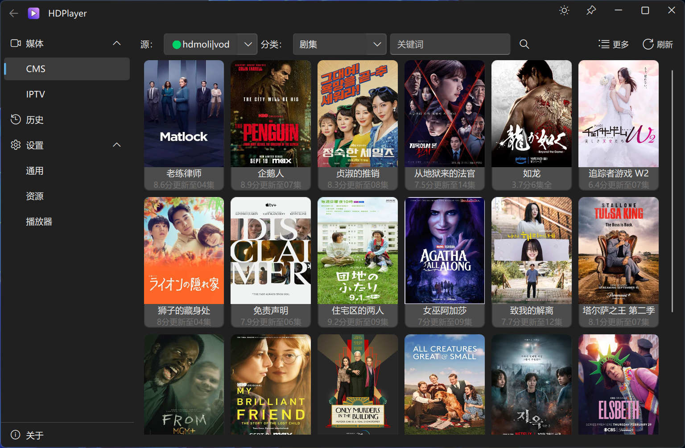
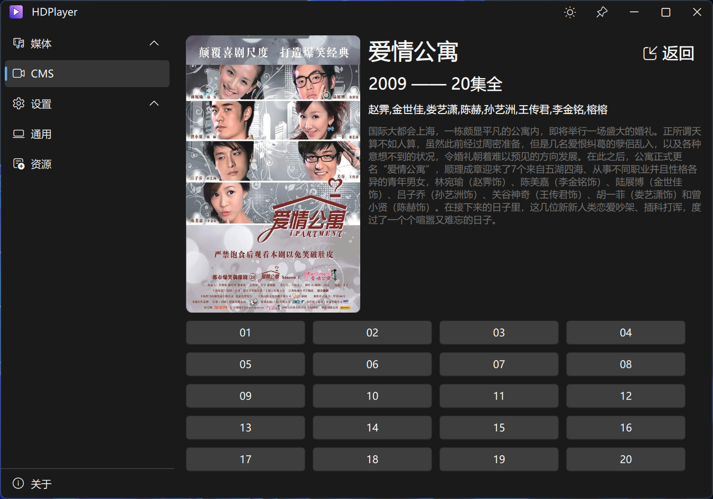

# HDPlayer

HDPlayer is a player based on web video connection. The software interface is implemented in Qt Fluent UI style and the playback function is based on MPV.

![release-badge] ![download-badge] ![download-latest]

[release-link]: https://github.com/ddhap/HDPlayer-Release/releases "Release status"
[release-badge]: https://img.shields.io/github/release/ddhap/HDPlayer-Release.svg "Release status"
[download-link]: https://github.com/ddhap/HDPlayer-Release/releases/latest "Download status"
[download-badge]: https://img.shields.io/github/downloads/ddhap/HDPlayer-Release/total.svg "Download status"
[download-latest]: https://img.shields.io/github/downloads/ddhap/HDPlayer-Release/latest/total.svg "latest status"

## Features
The released version contains the following features：

- Platform: windows 7 or above, 32 or 64bit
- CMS source play
- IPTV play
- VOD site play

## Screenshots
 
 

## Acknowledgements
The program is built with the following third-party libraries:
- [Qt](https://www.qt.io/)
- [zhuzichu520/FluentUI](https://github.com/zhuzichu520/FluentUI)
- [mpv](https://mpv.io/)
- [gabime/spdlog](https://github.com/gabime/spdlog)
- [nlohmann/json](https://github.com/nlohmann/json)

## Terms of Use
This software is intended for personal use only and is designed to connect to the web to play videos. It does not include any functions related to the collection, storage, sharing, or distribution of video files. In the event of any related disputes, the author assumes no responsibility. **Users must understand the relevant risks and responsibilities before using the software.**

Visitor Count:

Star History:

